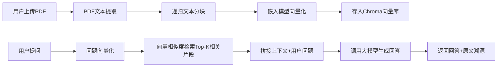

# RAG 私有知识库问答后端系统

## 项目简介
基于 FastAPI + Chroma 向量数据库 + 第三方大模型 API 实现的检索增强生成（RAG）后端服务。支持上传 PDF 文档构建私有知识库，用户提问时自动从向量库检索最相关的文档片段，结合大模型生成带原文溯源的准确回答，有效降低大模型幻觉问题。项目配套轻量静态前端页面，操作流程清晰，开箱即用。

## 技术栈
| 模块 | 技术选型 |
|------|----------|
| Web 框架 | FastAPI + Uvicorn |
| 向量数据库 | Chroma（本地持久化存储） |
| 嵌入模型 | BAAI/bge-large-zh-v1.5（开源中文嵌入模型） |
| 大模型 API | 兼容 OpenAI 标准接口（DeepSeek） |
| 文本处理 | LangChain RecursiveCharacterTextSplitter 递归分块 |
| PDF 解析 | pypdf |
| 前端 | HTML/CSS/JS |

## 系统架构


## 快速启动

1. 克隆项目到本地

```
git clone https://github.com/你的用户名/rag-backend-demo.git
cd rag-backend-demo
```

2. 创建虚拟环境并安装依赖

```
python -m venv venv
# Windows激活虚拟环境
venv\Scripts\activate
# 安装依赖
pip install fastapi uvicorn chromadb python-multipart pypdf python-dotenv langchain-text-splitters openai sentence-transformers modelscope
```

3. 配置环境变量：在项目根目录新建`.env`文件，填入你的大模型 API Key

```
DEEPSEEK_API_KEY=你的DeepSeek API Key
DEEPSEEK_BASE_URL=https://api.deepseek.com/v1
LLM_MODEL=deepseek-chat
```

4. 启动服务

```
python main.py
```

5. 打开浏览器访问 `http://127.0.0.1:8000` 即可使用完整交互界面

## 核心功能

1. **知识库上传**：支持上传 PDF 文档，自动完成文本提取、递归分块、向量化并存入本地持久化向量库
2. **RAG 问答**：用户提问时自动检索最相关的 Top-K 文档片段，调用大模型生成回答
3. **回答溯源**：回答结果同步展示引用的原始文档片段，方便校验回答准确性
4. **文件管理**：前端自动展示所有已上传知识库文件，刷新页面不丢失
5. **Markdown 渲染**：回答内容自动解析 Markdown 格式，排版清晰易读

## 接口说明

表格

| 接口 | 方法 | 功能 |
| --- | --- | --- |
| `/` | GET | 前端交互页面 |
| `/upload-pdf` | POST | 上传 PDF 到知识库 |
| `/ask` | POST | 基于知识库 RAG 问答 |
| `/files` | GET | 获取所有已上传文件列表 |

## 项目亮点

1. **自主实现核心检索逻辑**：不依赖全量黑盒 RAG 框架封装，手动实现向量嵌入、相似度检索、上下文拼接全流程
2. **工程化细节完善**：API 密钥通过环境变量管理，.gitignore 屏蔽敏感文件，向量库本地持久化，重启服务数据不丢失
3. **完整交互体验**：配套轻量前端页面，支持文件拖拽上传、Markdown 回答渲染、引用来源折叠展示，无需额外开发前端即可演示
4. **可扩展性强**：接口兼容 OpenAI 标准，可无缝切换不同厂商大模型，支持后续替换向量库、增加多模态解析、对话历史等进阶功能
